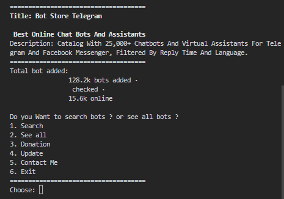

# Bot Store Telegram

Bot Store Telegram is a bot that allows you to search for bots in the Telegram store.

Bot Store Telegram adalah sebuah alat/program yang memungkinkan anda untuk mencari bot di Telegram.

bot = 128.2k

# How to use

## Windows Python
- Download [Python](https://www.python.org/downloads/) & [Git](https://git-scm.com/downloads)
- Download this repository as zip and extract it to a folder (or clone it) [Download](https://github.com/Xnuvers007/botstore/archive/refs/heads/master.zip)

- ``` git clone https://github.com/Xnuvers007/botstore.git ```
- Open cmd and type ``` cd botstore-master or cd botstore ```
- type ``` python botstore.py ```

## Linux Python
- ``` sudo apt update -y ; sudo apt upgrade -y ```
- ``` sudo apt-get install python3 ```
- ``` sudo apt-get install git ```
- ``` git clone https://github.com/Xnuvers007/botstore.git ```
- ``` cd botstore ```
- ``` python3 botstore.py ```

## Termux Python
- ``` apt update && apt upgrade -y ```
- ``` pkg update && pkg upgrade -y```
- ``` pkg install python3 ```
- ``` pkg install git `cp``
- ``` git clone https://github.com/Xnuvers007/botstore.git ```
- ``` cd botstore ```
- ``` pip install -r requirements.txt ```
- ``` python3 botstore.py ```

## Windows Executable
- Download this repository as zip and extract it to a folder (or clone it) [Download](https://github.com/Xnuvers007/botstore/archive/refs/heads/master.zip)
- go to folder botstore-master/output ``` cd botstore-master/output ```
- run ``` Bot Store Telegram by Xnuvers007.exe ```

# Image
